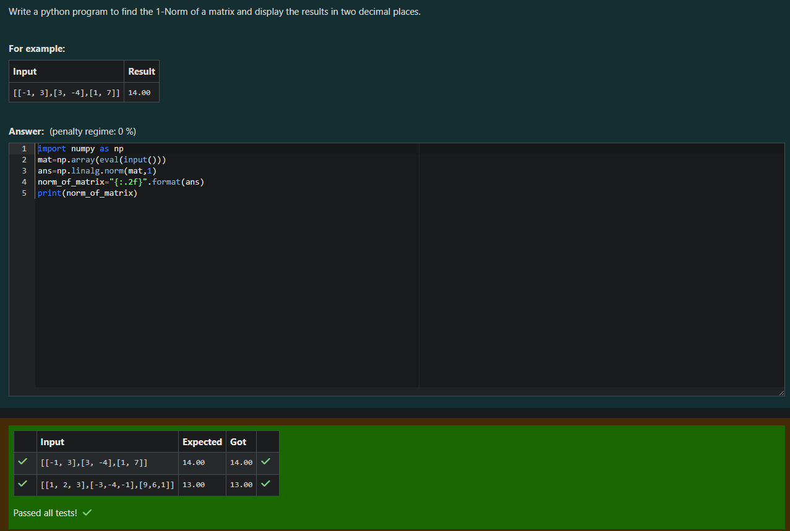
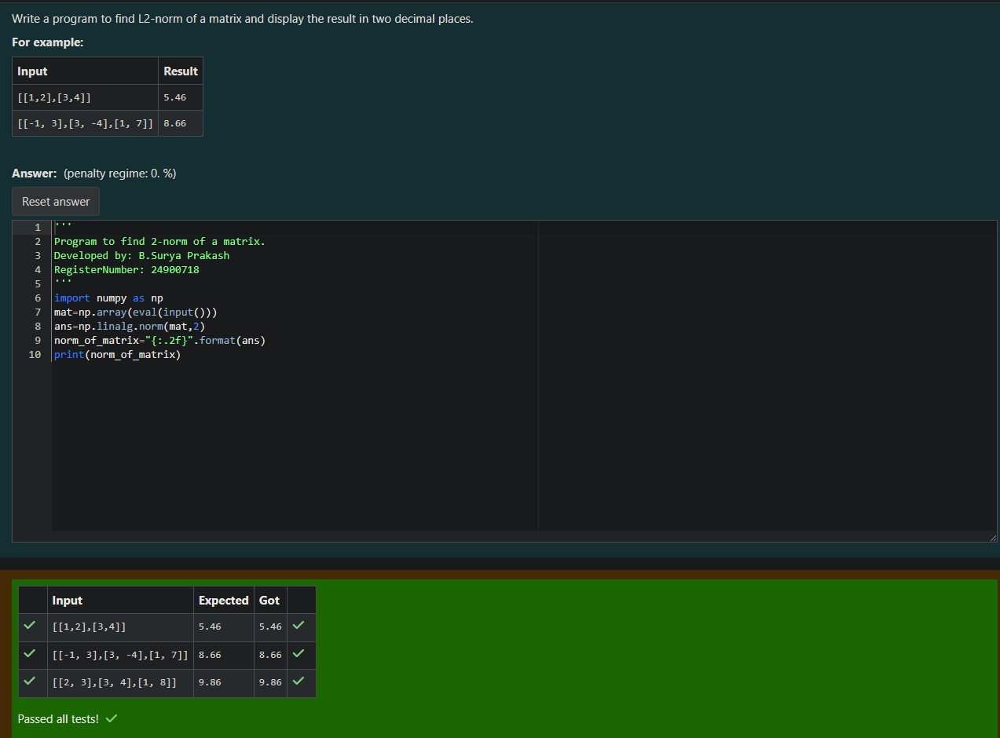
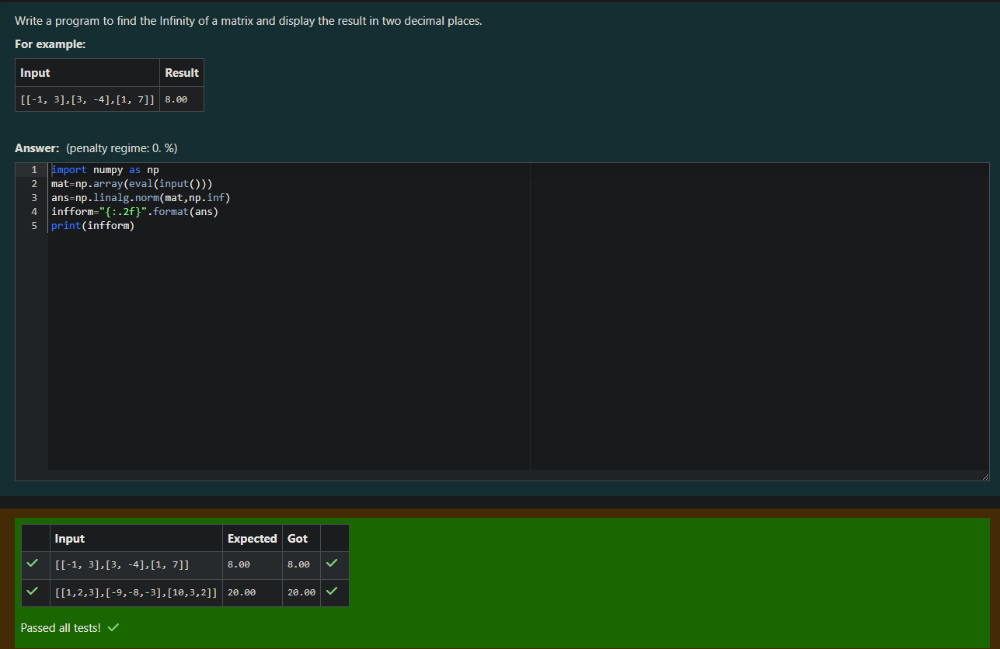

# Norm of a matrix
## Aim
To write a program to find the 1-norm, 2-norm and infinity norm of the matrix and display the result in two decimal places.
## Equipment’s required:
1.	Hardware – PCs
2.	Anaconda – Python 3.7 Installation / Moodle-Code Runner
## Algorithm:

**1-Norm of a Matrix (Maximum Column Sum Norm)**

Algorithm:

1.Take the matrix as input.
Use the numpy.linalg.norm function with the argument 1, which calculates the 1-norm (maximum absolute column sum norm).

2.Format the result to two decimal places.

3.Print the result.

**2-Norm of a Matrix (Frobenius Norm)**
 
Algorithm:

1.Take the matrix as input.
Use the numpy.linalg.norm function with the argument 2, which calculates the 2-norm (Euclidean norm, also known as Frobenius norm).

2.Format the result to two decimal places.

3.Print the result.

 **Infinity Norm of a Matrix (Maximum Row Sum Norm)**
Algorithm:

1.Take the matrix as input.
Use the numpy.linalg.norm function with the argument np.inf, which calculates the infinity norm (maximum absolute row sum norm).

2.Format the result to two decimal places.

3.Print the result.


## Program:
```Python
# Register No: 212224230281
# Developed By: B.SURYA PRAKASH
# 1-Norm of a Matrix
	import numpy as np
	mat=np.array(eval(input()))
	ans=np.linalg.norm(mat,1)
	norm_of_matrix="{:.2f}".format(ans)
	print(norm_of_matrix)


# 2-Norm of a Matrix
	import numpy as np
	mat=np.array(eval(input()))
	ans=np.linalg.norm(mat,2)
	norm_of_matrix="{:.2f}".format(ans)
	print(norm_of_matrix)


# Infinity Norm of a Matrix
	import numpy as np
	mat=np.array(eval(input()))
	ans=np.linalg.norm(mat,np.inf)
	infform="{:.2f}".format(ans)
	print(infform)


```
## Output:
### 1-Norm of a Matrix
<br>

### 2-Norm of a Matrix 
<br>

### Infinity Norm of a Mtrix
<br>


## Result
Thus the program for 1-norm, 2-norm and Infinity norm of a matrix are written and verified.
